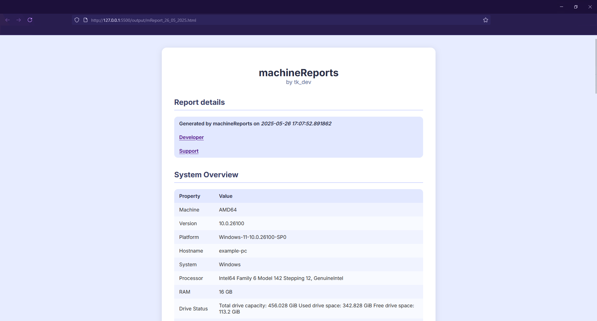

# machineReports

## System and development environment report creation



machineReports enables you to easily create detailed system reports containing:

- Hardware information
- IP/MAC addresses, online check
- Firewall information and rules
- User information
- Shell information
- Environment variables
- Config files
- Installed software
- Node/npm version
- Python version and path
- Installed package managers
- Installed pip packages
- Git config

## How to use the script

0. Download the repository
1. Install the dependencies from requirements.txt
2. Run main.py
3. The report is in the repository directory

**Important information: The .dll file ```libusb-1.0.dll``` is required to log/report USB connections as the pyusb module depends on it. You can check the file integrity [on the libusb GitHub](https://github.com/libusb/libusb/releases/tag/v1.0.28). If you are unsure, you can also replace the existing .dll file with your own build or remove the USB logging altogether. To do that, first delete the dll, then delete ```bus.py``` and remove every reference to it in ```main.py```.**

## Help/Support

[Developer Website](https://tk-dev-software.com)

[Support](https://tk-dev-software.com/appsupport)

# tk_dev - Software with passion.